# VSD_PACKAGING_WORKSHOP
Semiconductor Packaging Fundamentals

# Overview

Semiconductor packaging is one of the most critical domains in modern electronics manufacturing. While transistor scaling has traditionally driven semiconductor innovation, advanced packaging technologies have now become equally important in determining system-level performance, bandwidth, thermal efficiency, power delivery capability, and reliability.

This repository documents my learning journey through semiconductor packaging fundamentals, manufacturing flows, package architectures, wafer-level processing, reliability testing, and modern high-performance packaging technologies used in AI accelerators, CPUs, GPUs, automotive electronics, and high-speed computing systems.

The course provided practical exposure to how a fragile bare semiconductor die is transformed into a mechanically reliable, electrically functional, and thermally optimized package capable of operating in real-world systems.

---

# Why Semiconductor Packaging Matters

Bare semiconductor dies are extremely delicate and cannot be directly integrated into electronic systems.

A semiconductor package:
1. Protects the fragile semiconductor die from physical damage, moisture, contamination, oxidation, and environmental stress.
2. Enables reliable electrical interconnections between the die, substrate, PCB, and other semiconductor components within the system.

Modern packaging technologies are responsible for:

- Mechanical protection of the die
- Electrical signal routing
- Power delivery
- Thermal dissipation
- Reliability enhancement
- High-density integration
- System miniaturization
- High-speed interconnect enablement

Advanced packaging technologies include:

- Flip-Chip Packaging
- 2.5D Integration
- 3D IC Stacking
- Chiplet Architectures
- HBM Integration
- Silicon Interposers
- Fan-Out Wafer Level Packaging
- CoWoS Packaging

---

# Semiconductor Package Structure

A semiconductor package typically consists of:

1. Semiconductor Die
2. Die Attach Material
3. Substrate or Carrier
4. Interconnect Structure
5. Encapsulation Material
6. External I/O Interface

The semiconductor die is mounted on a carrier or substrate, followed by electrical interconnection using wire bonds or solder bumps. The package is then encapsulated using molding compound for protection and reliability enhancement.

The black external covering commonly observed in IC packages is the molding compound, which protects the internal structure from:

- Moisture
- Contamination
- Mechanical stress
- Oxidation
- Environmental damage

---

# Package Selection Methodology

Selecting the correct semiconductor package depends on multiple engineering and manufacturing constraints.

## Important Selection Parameters

### 1. Application Requirements

Different applications require different packaging approaches.

Examples:
- Automotive systems prioritize reliability
- Mobile devices prioritize compact size
- AI accelerators prioritize bandwidth and thermal efficiency

### 2. I/O Count and Connectivity

High-performance systems require:
- Higher pin count
- Faster interconnects
- Better signal integrity

### 3. Thermal Dissipation

Thermal performance is one of the most important factors in package design.

Packages used in high-power systems require:
- Better heat spreading
- Lower thermal resistance
- Improved substrate materials

In high-temperature environments, laminate materials may become unsuitable and ceramic-based packages may be preferred.

### 4. Reliability and Durability

Packages must survive:
- Mechanical stress
- Thermal cycling
- Moisture exposure
- Long-term operation

### 5. Cost and Manufacturing Complexity

Advanced packaging technologies improve performance but significantly increase:
- Manufacturing complexity
- Yield challenges
- Production cost

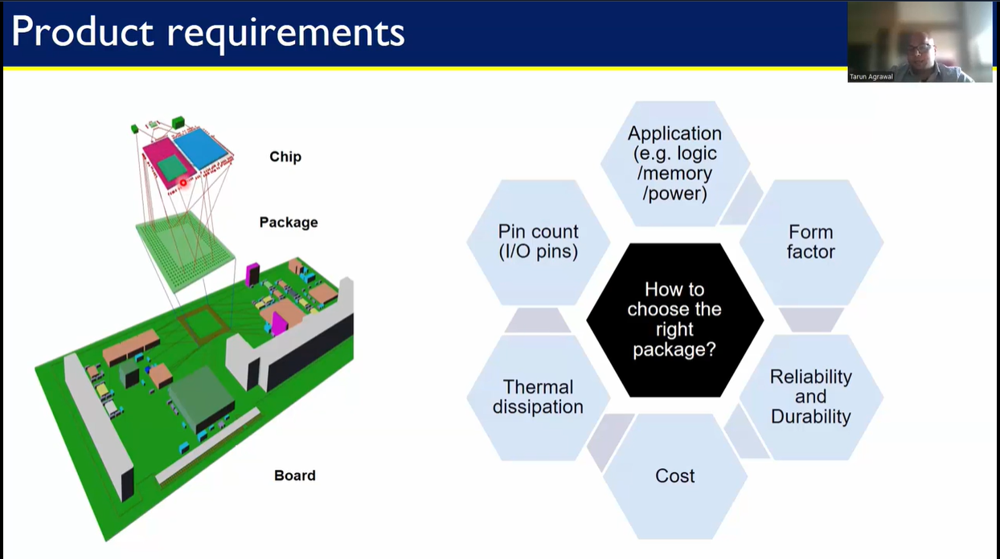

---

# Package Classification

Semiconductor packages can broadly be classified based on mounting methodology.

---

# Through-Hole Mounting (THM)

In through-hole mounting, package leads pass through PCB holes and are soldered on the opposite side.

## Examples

- DIP (Dual Inline Package)
- PGA (Pin Grid Array)

## Advantages

- Strong mechanical attachment
- Better durability
- Suitable for high-reliability systems

## Disadvantages

- Larger PCB area
- Lower integration density
- Not ideal for miniaturized systems

---

# Surface Mount Technology (SMT)

Surface Mount Technology enables packages to be mounted directly on PCB surfaces.

## Examples

- QFN — Quad Flat No-Lead  
A surface-mount package with no external leads extending outward. Electrical connections are made through pads located underneath the package. QFN packages provide good thermal and electrical performance with compact size and are widely used in mobile, consumer, and RF applications.

- QFP — Quad Flat Package  
A surface-mount package with leads extending from all four sides of the package body. QFP packages support moderate-to-high pin counts and are commonly used in microcontrollers, processors, and communication ICs.

- CSP — Chip Scale Package  
A package whose size is nearly the same as the semiconductor die itself. CSP enables high integration density, smaller footprint, and improved electrical performance for compact electronic devices.

- PBGA — Plastic Ball Grid Array  
A BGA package using plastic substrate material with solder balls arranged in a grid pattern underneath the package. PBGA supports higher pin count, better thermal performance, and improved electrical characteristics compared to traditional leaded packages.

- LGA — Land Grid Array  
A package that uses flat conductive pads instead of solder balls or pins for electrical interconnection. LGA packages are widely used in high-performance processors and applications requiring high I/O density and reliable electrical contact.

- PoP — Package on Package  
An advanced packaging technology where multiple packages are vertically stacked on top of each other to improve space utilization and integration density. Commonly used in smartphones and compact embedded systems.

- MCM — Multi-Chip Module  
A package containing multiple semiconductor dies integrated within a single package substrate. MCM improves performance, reduces interconnect length, and enables higher functional integration.

- CoWoS — Chip-on-Wafer-on-Substrate  
An advanced 2.5D packaging technology developed for high-bandwidth and high-performance systems. It uses silicon interposers to integrate multiple dies such as GPUs and HBM memory within a single package, enabling extremely high bandwidth and integration density for AI and HPC applications.

## Advantages

- Smaller package footprint
- Higher integration density
- Better electrical performance
- Reduced parasitics
- Faster signal transmission
- Better scalability

SMT packaging dominates modern semiconductor systems because of its ability to support compact and high-speed electronic products.

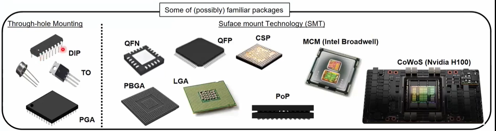

---

# Package Carrier and Substrate Technologies

The substrate or carrier forms the mechanical and electrical foundation of the package.

## Common Carrier Materials

### Leadframe

Used in:
- DIP
- QFN
- QFP

Characteristics:
- Low cost
- Mature manufacturing process
- Suitable for low-to-medium complexity devices

### Laminate Substrates

Used in:
- PBGA
- Flip-Chip BGA
- LGA
- FC-CSP

Characteristics:
- Good routing capability
- Moderate cost
- Widely used in modern packages

### Ceramic Substrates

Characteristics:
- Excellent thermal performance
- High reliability
- Suitable for harsh environments
- Higher cost

### Silicon Interposers

Used in advanced 2.5D integration.

Advantages:
- Very fine routing capability
- High bandwidth interconnects
- Suitable for HBM integration

### Glass Interposers

Emerging technology with potential advantages in:
- Signal integrity
- Low warpage
- High-density routing

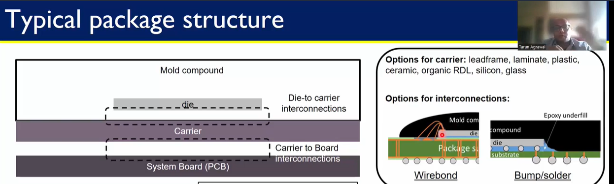
---
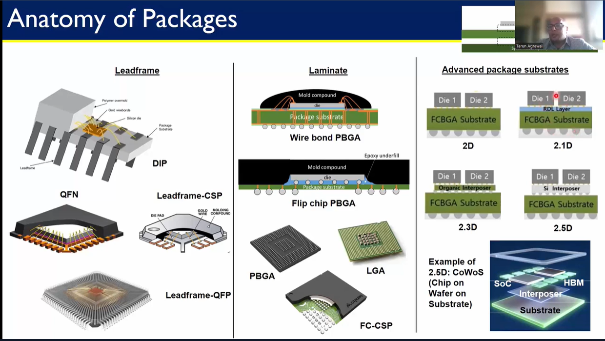

# Interconnection Technologies

Interconnect technology is one of the most critical aspects of semiconductor packaging.

Two major interconnection methods studied:

1. Wire Bonding
2. Flip-Chip Bonding

---

# Wire Bond Packaging

Wire bonding is one of the most widely used semiconductor packaging technologies.

Electrical connections are formed between the die pads and substrate using thin metallic wires.

## Common Wire Materials

- Gold
- Aluminum
- Copper

## Wire Bond Packaging Flow

### Step 1 — Known Good Die Selection

After wafer dicing, functional dies are identified and selected.

### Step 2 — Die Attach

The die is attached onto the substrate using epoxy-based die attach material.

### Step 3 — Curing Process

The package is heated in a curing oven to strengthen mechanical attachment and reduce stress.

### Step 4 — Wire Bond Formation

Fine metallic wires form electrical interconnections between die pads and substrate.

### Step 5 — Molding Process

Transfer molding protects the package internally.

### Step 6 — Marking

Package identification and traceability information are added.

### Step 7 — Singulation

Individual packages are separated using dicing or cutting processes.

## Advantages of Wire Bonding

- Cost-effective
- Mature manufacturing ecosystem
- High production throughput
- Reliable for many applications

## Limitations

- Longer interconnect path
- Higher parasitics
- Lower bandwidth capability
- Limited scalability for very high I/O systems

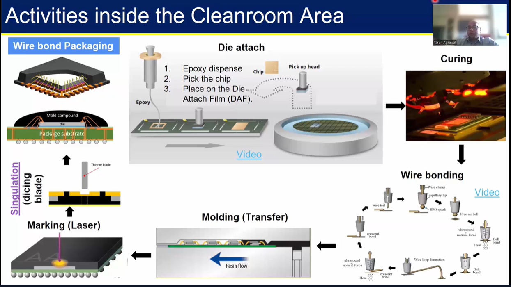

---

# Flip-Chip Packaging

Flip-chip technology replaces wire bonds with solder bumps directly formed on the die.

The die is flipped upside down and connected directly onto the substrate.

## Important Characteristics

- Smaller bump pitch
- Shorter electrical path
- Lower parasitics
- Higher I/O density
- Better thermal dissipation
- Improved signal integrity

## Flip-Chip Process Flow

### Bump Formation

Solder bumps are formed on wafer pads.

### Wafer Preparation

The wafer undergoes processing and inspection.

### Die Placement

The die is aligned and placed onto the substrate.

### Mass Reflow

Thermal processing melts solder bumps and forms electrical connections.

### Thermal Compression Bonding

Additional bonding techniques improve connection reliability.

### Ball Mounting

External package balls are attached for PCB interfacing.

## Advantages of Flip-Chip Packaging

- Higher performance
- Better thermal management
- Improved electrical characteristics
- Higher interconnect density

## Applications

- CPUs
- GPUs
- AI accelerators
- High-performance networking devices
- Advanced SoCs

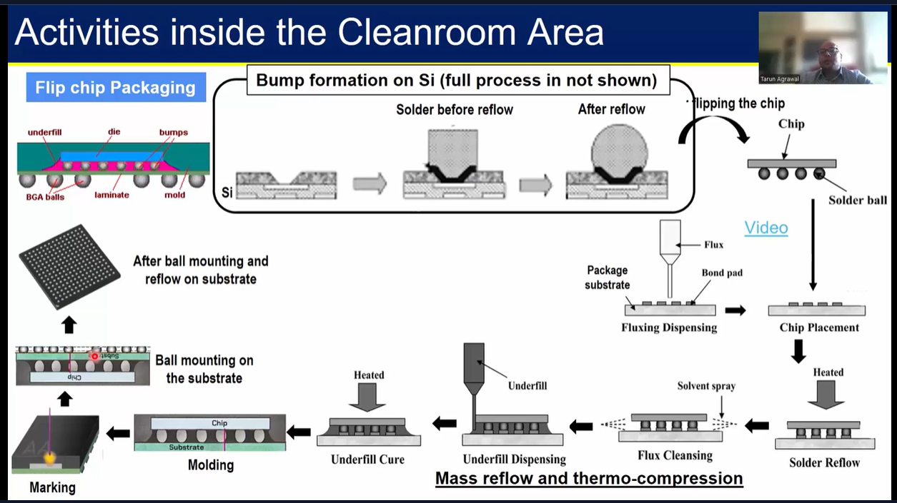

---

# Wafer-Level Packaging (WLP)

Wafer-Level Packaging enables packaging operations to occur directly at wafer level before singulation.

This significantly improves integration density and reduces overall package size.

## Important Concepts Studied

### Redistribution Layer (RDL)

RDL enables signal redistribution between die pads and external solder balls.

### Reconstitution Process

Known good dies are placed onto a temporary carrier and molded together.

### Temporary Carrier Usage

Used for wafer handling during processing.

### Solder Ball Attachment

External package connections are formed on the RDL structure.

## Advantages of WLP

- Smaller form factor
- Better electrical performance
- Reduced package thickness
- Improved integration capability
- Lower interconnect parasitics

## Applications

- Mobile processors
- Wearables
- Compact consumer electronics
- High-density integrated systems

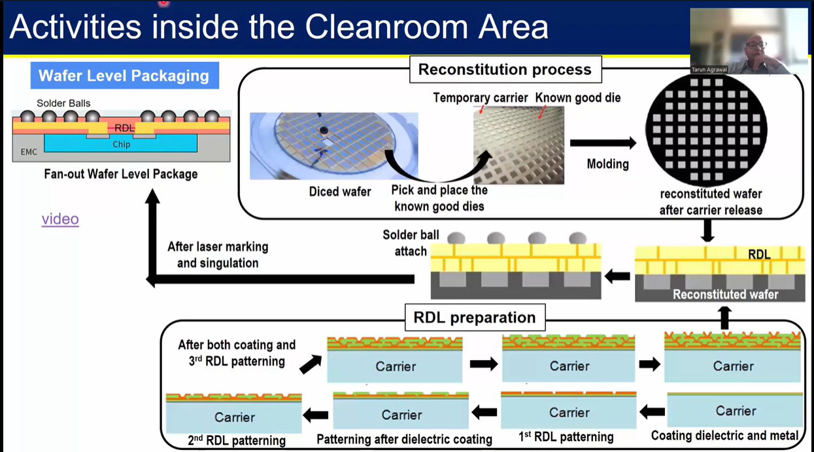

---

# Semiconductor Packaging Supply Chain

The semiconductor manufacturing ecosystem involves multiple stages.

## Supply Chain Flow

1. Design House
2. Wafer Fabrication
3. Package Assembly and Test
4. Board Assembly and Test
5. Product Assembly and Final Validation

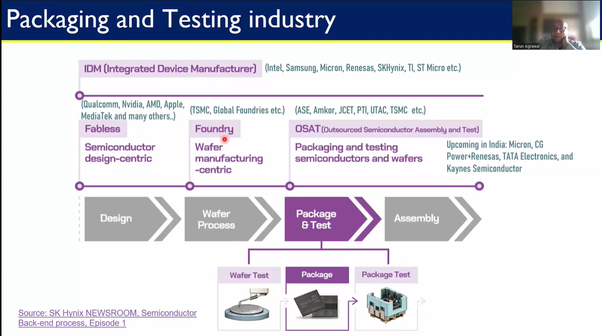
---

# Supply Chain Terminologies

## IDM — Integrated Device Manufacturer

An IDM performs multiple semiconductor stages internally including:
- Design
- Fabrication
- Packaging
- Testing

---

## ATMP — Assembly, Testing, Marking, and Packaging

ATMP refers to the semiconductor backend manufacturing process.

Activities include:
- Assembly
- Package formation
- Marking
- Electrical testing
- Reliability validation

---

## OSAT — Outsourced Semiconductor Assembly and Test

OSAT companies specialize in semiconductor packaging and testing services.

They provide packaging solutions for fabless semiconductor companies and external customers.

---

# Cleanroom Packaging Operations

Packaging assembly is performed in controlled cleanroom environments.

## Wafer Preparation Area

Typical cleanroom classification:
- ISO Class 7

Used for:
- Wafer handling
- Wafer transport
- Contamination control

---

# Wafer Preparation and Dicing Flow

## Wafer Inspection

Initial wafer inspection identifies defects and verifies wafer quality.

## Front-Side Lamination

Protective lamination protects the active wafer surface.

## Backside Grinding

Wafer thickness is reduced to achieve target mechanical and thermal requirements.

## Tape Frame Mounting

The wafer is mounted onto a tape frame for handling.

## Wafer Dicing

Individual dies are separated using:
- Laser grooving
- Blade dicing

This stage is critical because die damage directly impacts package yield.

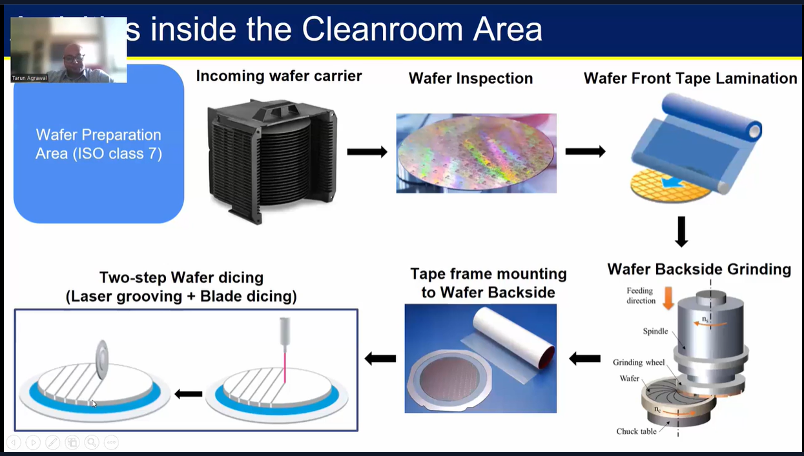

---

# Reliability and Package Testing

Semiconductor packages must undergo extensive testing before deployment.

Testing ensures:
- Electrical functionality
- Long-term reliability
- Thermal robustness
- Manufacturing quality

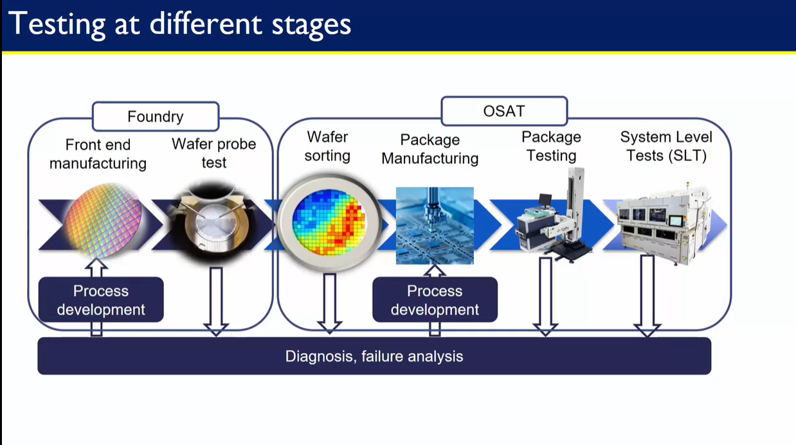

---

# Package Testing Flow

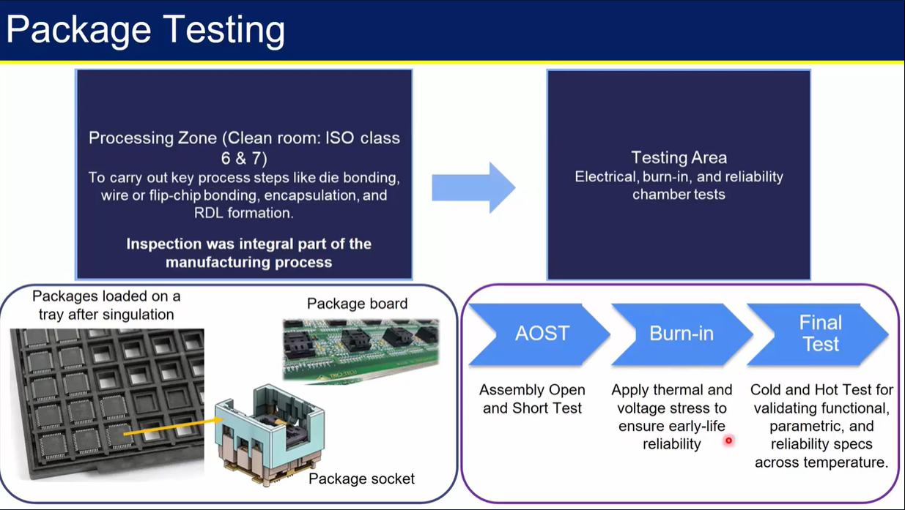

## Assembly Open and Short Test (AOST) - Functionality Testing

Verifies:
- Open connections
- Short circuits
- Basic connectivity
- Ensures package functionality under operational conditions.

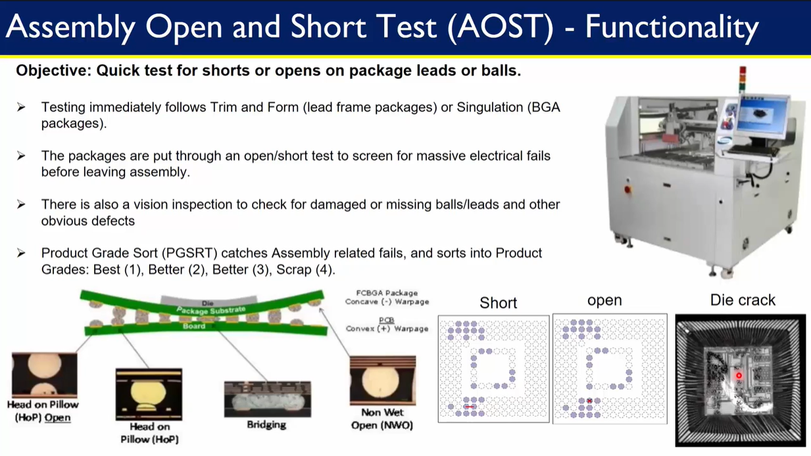

## Burn-In Testing

Burn-in testing applies:
- Thermal stress
- Voltage stress
for extended periods to identify early-life failures.

This helps improve long-term reliability.

### Bathtub Curve

The bathtub curve describes semiconductor failure behavior across product lifetime:

1. Early-life failures
2. Useful operational life
3. Wear-out failures

Burn-in testing primarily targets early-life failures.

---

## Chamber Testing

Packages are tested under extreme environmental conditions.

Examples:
- High temperature
- Low temperature
- Humidity exposure

---

## Final Testing

Final package validation includes:
- Hot testing
- Cold testing
- Parametric testing
- Functional testing
- Reliability verification

---

# Important Manufacturing Metrics

Key manufacturing metrics include:

- Yield
- Test coverage
- Throughput
- Reliability
- Test time
- Defect rate

Yield optimization is extremely important because packaging defects significantly impact overall semiconductor manufacturing cost.

---

# Advanced Packaging Technologies

Modern semiconductor systems increasingly rely on advanced packaging approaches.

## 2.5D Packaging

Uses silicon interposers for connecting multiple dies.

Advantages:
- High bandwidth
- Improved integration
- Better signal integrity

Applications:
- AI accelerators
- HBM systems
- HPC platforms

---

## 3D IC Packaging

Multiple dies are vertically stacked.

Benefits:
- Reduced interconnect length
- Higher bandwidth
- Smaller footprint

Challenges:
- Thermal management
- Manufacturing complexity
- Yield optimization

---

## Heterogeneous Integration

Combines multiple chip types within a single package.

Examples:
- CPU + GPU integration
- Logic + memory integration
- RF + analog + digital integration

This is becoming increasingly important for AI and advanced computing architectures.

---

# Lab Component

TO DO analyze and compare modern semiconductor packaging technologies used in AI accelerators and high-performance computing systems.

---

# Technologies Compared

## 1. Wire Bond Packaging

Characteristics:
- Mature process
- Lower manufacturing cost
- Limited high-speed capability

---

## 2. Flip-Chip Packaging

Characteristics:
- Higher I/O density
- Better thermal performance
- Improved electrical behavior

---

## 3. 2.5D Packaging

Characteristics:
- Silicon interposer based
- Enables HBM integration
- High bandwidth capability

---

## 4. 3D IC Packaging

Characteristics:
- Vertical die stacking
- Extremely high integration density
- Very high bandwidth

Challenges:
- Thermal dissipation
- Manufacturing complexity
- Yield management

---

# Technology Comparison

| Technology | Bandwidth | Thermal Performance | Complexity | Cost | Integration Density |
|------------|------------|--------------------|------------|------|--------------------|
| Wire Bond | Medium | Medium | Low | Low | Medium |
| Flip-Chip | High | High | Medium | Medium | High |
| 2.5D | Very High | High | High | High | Very High |
| 3D IC | Extremely High | Challenging | Very High | Very High | Extremely High |

---

# Key Observations

- Advanced packaging is becoming a primary performance enabler.
- AI workloads increasingly require high-bandwidth memory integration.
- Thermal management is one of the biggest challenges in advanced packages.
- Packaging complexity is increasing faster than traditional package scaling.
- Heterogeneous integration is expected to dominate future semiconductor systems.

---

# References

- VSD Semiconductor Packaging Course

---
